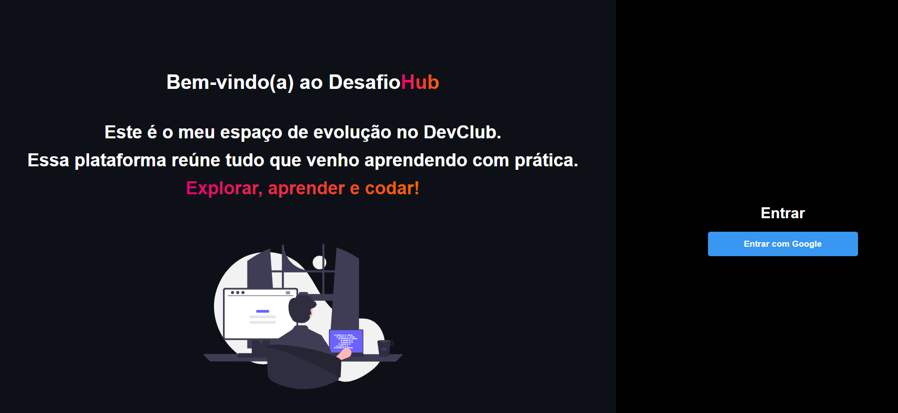
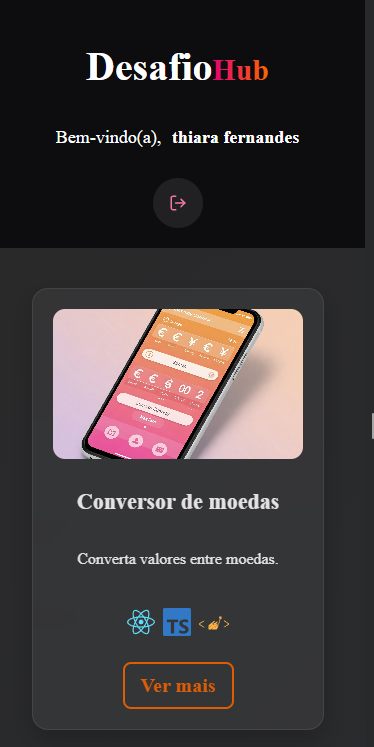

# DesafioHub 🚀


---

## 📌 Sobre o Projeto

O **DesafioHub** é uma plataforma criada para reunir e exibir de forma elegante os projetos desenvolvidos durante o curso **DevClub**.  
Cada desafio é apresentado através de um card interativo, com foco em design responsivo, limpo e moderno.

O projeto também conta com **autenticação via Google** utilizando o **Firebase Authentication**, proporcionando uma experiência de login simples e segura.

---

## 🛠 Tecnologias Utilizadas

- **React.js**
- **TypeScript**
- **Styled Components**
- **Vite**
- **Firebase Authentication**


---

## 🎯 Objetivo

Organizar e apresentar projetos práticos, servindo como um portfólio dinâmico dos desafios realizados no **DevClub**.

---

## 🔒 Funcionalidades

- Autenticação de usuários com Google via Firebase
- Logout de usuários
- Visualização de projetos após login
- Interface moderna e responsiva

---

## 🎨 Layout

- Interface moderna e minimalista
- Cards com efeitos de sombra
- Responsividade garantida (Desktop, Tablet e Mobile)
- Animações suaves em botões e cards

---

## 📸 Prints do Projeto

### 🔒 Tela de Login
<p align="center">

</p>

### 💻 Versão Desktop
<p align="center">

</p>

### 📱 Versão Mobile
<p align="center">

</p>


---

## 🚀 Como Rodar o Projeto

```bash
# Clone o repositório
git clone https://github.com/ThiaraFernandes/DesafioHub.git

# Acesse a pasta do projeto
cd DesafioHub

# Instale as dependências
npm install

# Rode o projeto
npm run dev


```
---

## 🌐 Visualizar Projeto Online
https://desafiohub.vercel.app/


## 🧡 Feito com muito carinho por Thiara Fernandes

